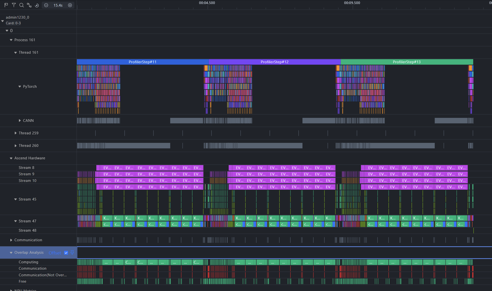

# Kimi K3 TorchTitan 实验进度记录（08.06-08.19）

## 一、实验目标与基线环境

目标：在 TorchTitan 上完成 Kimi K3 debugmodel 的 NPU 正确性复现后，建立可信的性能与内存基线，用 profile 证据确定瓶颈排序，为单变量优化实验做准备。

| 项           | 内容                                                                                                                                                                        |
| ----------- | ------------------------------------------------------------------------------------------------------------------------------------------------------------------------- |
| 模型          | Kimi K3 debugmodel（约 1 亿参数、13 层），topology-complete 结构：KDA（Kimi Delta Attention）、Gated MLA、LatentMoE、Attention Residual、多模态 MoonViT3d、160K 词表 lm_head                      |
| 代码基线        | TorchTitan 社区 PR [[kimi k3] add eager reference model with FSDP2 by JavaZeroo · Pull Request #4025 · pytorch/torchtitan](https://github.com/pytorch/torchtitan/pull/4025) |
| 基线commit id | `9f60a3d6d222bd63079a0710c2d640eeb2befcd1`，以下简称`E0`                                                                                                                       |
| 环境          | CANN 9.1.0 正式版、PyTorch 2.12 + torch_npu 2.12；                                                                                                                             |
| 并行          | 4 卡 FSDP2 纯数据并行（HSDP/TP/PP/CP/EP 均未启用）                                                                                                                                    |

## 二、已验证内容（正确性基线）

1. **E0 失败边界与兼容修复**：E0 在 chunked loss 两阶段 backward 下，因 final norm 与 `lm_head` 共享 FSDP unit 触发未分配 storage 错误；将两者拆为独立 FSDP units 的兼容 patch 后，问题修复，四卡 BF16 训练正确性通过，修复已固化为独立分支。
	1. 修复分支[Coco970963014/torchtitan at topic/fsdp-compat](https://github.com/Coco970963014/torchtitan/tree/topic/fsdp-compat)；相关commit id：71096dc27beb3fcafcbe07ae7de5e0eb6c679668
	2. PS：该问题也可通过升级pytorch nightly版本解决，但PTA/torch_npu 的版本配套可能滞后
2. **NPU profiler 工具链打通**：TorchTitan `torch_npu.profiler` 适配 patch 通过单卡/四卡功能验证，四 rank CANN trace 产物完整，支撑了后续全部热点与内存归因实验。
	1. 适配分支[Coco970963014/torchtitan at topic/torch-npu-profiler](https://github.com/Coco970963014/torchtitan/tree/topic/torch-npu-profiler)；相关commit id：c37d4a3d576def1edbbaca99a3dcb01d6aaa4841、21b6f382ee6ad4ea2a99165968157dcafbb8f453

## 三、内存负载基线

### 3.1 压力工作负载选择

已完成不同 batch/sequence 组合的无 profiler 内存压力搜索：

| 工作负载 | 结果 | 判断 |
|---|---:|---|
| batch 1，seq `256/512/1024/2048` | 显存压力较低 | 只用于确认 sequence 增长路径 |
| batch 1，seq `4096` | 物理 HBM 约 `9.66 GiB` | 未进入压力区 |
| batch 4，seq `8192` | 物理 HBM 约 `61.97/64 GiB` | 接近硬件边界，不作为基线或 A/B workload |
| batch 2，seq `8192` | allocator peak active 约 `24.41 GiB`，reserved 约 `27.28 GiB` | 作为后续稳定性和内存特性实验 workload |

最终固定使用 `local_batch_size=2, seq_len=8192`，在保持明显内存压力的同时保留足够安全余量，不以 OOM 为实验目标。

### 3.2 60-step 无 profiler 稳定性/吞吐基线（标准压力 workload）

- step 11-60 共 50 个样本（每 step 取最慢 rank）：均值 4249 ms、p50 4240 ms、p95 4297 ms、CV 0.98%。
- 名义全局吞吐约 15423 tokens/s（每卡约 3856 tokens/s）。
- 最大同 step rank 差仅 0.34%，无持续 rank 失衡；周期性 GC 形成的最大长尾也只比 p50 高约 6%。
- 结论：workload 与环境稳定，可支撑后续成对 feature-off/feature-on A/B。

### 3.3 profiler采集分析结果
经过前10个step预热期，在单step时长稳定后，采集连续3个step：

- Computing 占 Stage 91.3%，非重叠通信仅 1.9%，Free 6.8%——瓶颈是**计算而非 HCCL 通信**。
- KDA backward 两个 kernel（`wy_dA_finalize` + `intra`）合计占设备算子时间 **约 82%**，每 rank-step 约 3.23 s。
- 结论：单变量性能优化的首选对象是 KDA backward 计算。

### 3.4 内存来源结论

通过无 profiler 阶段打点，在 `after_forward`、`after_backward`、`after_optimizer` 边界读取 allocator 状态：

- `after_forward` active 约 `20.2 GiB`，是主要长期存活内存。
- `after_backward` 出现更高的临时峰值。
- `after_optimizer` active 约 `194 MiB`，说明 optimizer state 不是当前主要峰值来源。
- allocator peak active/reserved 比例约为 `83%-89%`，当前问题不是单纯的 allocator 空闲缓存或碎片。

当前内存瓶颈优先定位为 **forward 到 backward 之间长期存活的 activation**；现有阶段数据没有表明 AdamW optimizer state 是主要峰值来源。

## 四、Chunked Loss 实验结论

TorchTitan 原生 `ChunkedLossWrapper` 分块执行 `lm_head + CE` 以控制 160K 词表 logits 峰值，是正式训练路径的一部分。在标准压力 workload 下完成 4/8/16 三档单变量对比：

### 4.1 Profiler memory trace 结果

在相同四卡、batch `2`、seq `8192` 和相同采集配置下，完成 `num_chunks=4/8/16` 三组 `profile_memory=True, with_stack=False` trace：

| `num_chunks` | trace 单 rank 单 step 平均 Stage |              相对默认 `8` | after-forward active | after-backward peak active |
| -----------: | ---------------------------: | --------------------: | -------------------: | -------------------------: |
|            4 |                `4524.294 ms` | `-20.833 ms`，`-0.46%` |       `20238.01 MiB` |             `29461.42 MiB` |
|            8 |                `4545.127 ms` |                    基线 |       `20242.27 MiB` |             `24993.04 MiB` |
|           16 |                `4594.126 ms` | `+48.999 ms`，`+1.08%` |       `20240.10 MiB` |             `22964.06 MiB` |

结论：
1. `num_chunks=16` 相比 `num_chunks=8` 可略微降低 chunked loss backward 临时峰值，但三档 after-forward active 基本不变；`num_chunks=4` 内存表现最差。
2. 调大 `num_chunks` 至`16`只压缩 lm_head/loss backward 的临时峰值，**不降低约 20 GiB 的主激活**，收益上限约 2 GiB。
3. 从 profiler trace 的单 step Stage 观察看，`16` 比 `8` 高约 `49 ms`，`4` 比 `8` 低约 `21 ms`。但受采集开销影响，不构成吞吐结论，需专门 A/B 确认。

### 4.2 无 profiler 60-step 长稳复核
未排除采集开销影响与短时 profiler trace 的偶然性，已在相同 workload 上完成三组无 profiler、60-step 长稳复核。每组均使用阶段 allocator 打点；按 step `11-60`、每 step 取四 rank 最慢值的口径重新汇总。

| `num_chunks` | 最慢 rank 平均 step |      p95 step |       CV | after-forward max active | after-backward max peak active | max peak reserved |
| -----------: | --------------: | ------------: | -------: | -----------------------: | -----------------------------: | ----------------: |
|            4 |   `4353.268 ms` | `4398.594 ms` | `0.610%` |           `20284.97 MiB` |                 `29507.86 MiB` |    `34396.00 MiB` |
|            8 |   `4357.800 ms` | `4402.619 ms` | `0.603%` |           `20282.61 MiB` |                 `25027.47 MiB` |    `27972.00 MiB` |
|           16 |   `4371.282 ms` | `4402.095 ms` | `0.538%` |           `20286.47 MiB` |                 `23008.34 MiB` |    `26214.00 MiB` |

- num_chunks=16 有明确但有限的内存收，但存在轻微的平均 step 时长上升迹象。
- 建议以 num_chunks=8 作为基准配置；16 保留为内存优先场景的候选。

### 6. TorchTitan 原生 chunk loss 与 FSDPTurbo `chunk_loss` 源码对比

- 两者数学与内存策略等价（同为序列维切分、逐块 `lm_head + CE` + backward、预分配梯度 buffer）；TorchTitan 版本是功能超集（FSDP2 生命周期集成、TP loss-parallel、DTensor/CP 组合、fp32 梯度累积）。
- FSDPTurbo `chunk_loss` 未被其自身框架主流程接线，仅有的增量（尾块不等长切分、grad_output 显式缩放、per-example 加权）对本 workload 无实质收益。
- 结论：**不移植 FSDPTurbo `chunk_loss`**，保持"调 TorchTitan 原生参数"路线；FSDPTurbo 五项内存特性中仅借鉴其"按内存来源选择特性"的分类方法，其外层框架与 swap 特性均不接入（`chunk_batch` 对 K3 的 Attention Residual 输入结构不安全，`swap_activation`/`swap_optimizer` 当前无证据支持收益）。

### 7. 工具问题记录

- torchtitan当前并不原生支持`torch.profiler`采集，需要进行接入层适配
- torchtitan接入`torch.profiler`后，当前环境启用 `with_stack=True` 时，四个 rank 均会在 profiler native `stop_trace()` 阶段触发 `SIGSEGV`，且已确认当前 PyTorch、TorchNPU、CANN 和 Python 版本与官方兼容矩阵一致，具体原因待向profiler组件反馈确认。

## 六、阶段性结论

1. Kimi K3 在当前 E0 CANN 9.1.0 环境下已完成 TorchTitan FSDP2 适配和 BF16 正确性验证，精度/数值稳定性门禁通过。
2. `batch=2, seq_len=8192` 是当前可重复、具有安全余量的内存压力基线。
3. 当前主要内存负载来自 forward 到 backward 之间的 activation，optimizer state 不是主要瓶颈。
4. TorchTitan 原生 chunked loss 已有效控制词表 logits 临时峰值。建议以 `num_chunks=8` 作为基准配置；`16` 保留为内存优先场景的候选。 `num_chunks=4` 内存表现明显较差，应排除。

## 七、下一步计划

### 7.1 迁移新基线：PR #4025 上游 fla-eager 演进

PR #4025 线上出现了多项后续更新（社区 fork `the-fall-moon/torchtitan` 分支 `agent/kimik3-fla-eager`，最新 commit `9c296f4`）：MLA 重构为继承 TorchTitan `BaseAttention`，内部注意力改用 SDPA/FlexAttention 后端（不再物化显式 attention scores）；KDA 短卷积、门控 RMSNorm、Attention Residual 更换为 fla 融合算子（`causal_conv1d`、`rms_norm_gated`、`fused_attnres`）；数值验证脚本已支持 NPU 设备。计划以 `1da44c1`（数值验证基点）之上的 fla 算子最小接入为基础建立新实验基线。

迁移步骤：拉取并冻结新基线 → rebase FSDP compat 与 profiler patch → 用自带数值脚本（已支持 NPU）做正确性门 → 重建 60-step 基线与阶段内存打点。**注意：fla 融合算子与 SDPA 注意力会改变 activation 构成（如不再保存显式 scores 和 conv 中间量），旧 E0 数据继续保留为内存来源、优化方向和趋势对照依据，但其绝对内存与性能数值需在新实现上重新校准。**

### 7.2 内存优化特性一：重计算（recompute / activation checkpointing）

TorchTitan 原生提供 FullAC / SelectiveAC / MemoryBudgetAC 三档重计算框架，K3 的 `parallelize.py` 当前显式不支持（`NotImplementedError`）。计划仿照 Qwen/Llama 路径为 K3 增加"FSDP wrap 前应用 AC"的接入，第一轮只做 FullAC 单变量。专项验证边界：K3 block 的 `(hidden_states, block_residual_TND)` 双输出、跨 block Attention Residual、vision encoder 是否参与。

对比结论：FSDPTurbo 的 `recompute` 仅是 `torch.utils.checkpoint(use_reentrant=False)` 的模块级包装，无选择性策略、无策略框架、无 FSDP2 组合证据，**无可借鉴增量，确定采用 TorchTitan 原生方案**。SelectiveAC 的默认 save-ops 集合面向 CUDA 算子，NPU 上需自定义算子集合（KDA 的 Triton 融合算子能否被策略捕获是待验证项），排在 FullAC 之后。

### 7.3 内存优化特性二：swap activation（activation offload）

计划接入。
TorchTitan 无原生 swap activation 实现。FSDPTurbo 的交换机制（`TensorSwapContext`：saved-tensor pack/unpack 钩子 + pinned host buffer + 独立异步 D2H/H2D 流 + 按层索引 prefetch + `storage().resize_(0)` 释放设备显存）经初步源码调研显示，**机制本身覆盖模块内所有为 backward 保存的 tensor，包括内部中间量**；
默认 check_fn 的策略选择只交换模块输入，预计对Kimi-K3收益较低（单层输入约 8 MiB × 13 层，而约 20 GiB 主体在 KDA/MLA/MoE 内部中间量），但**机制本身覆盖模块内所有为 backward 保存的 tensor，包括内部中间量**；，因此正确路线是**复用其基础设施、重写选择策略**。

有个便宜的先行步骤：PyTorch 原生 torch.autograd.graph.save_on_cpu(pin_memory=True) 就是“全量换出”的 10 行通用版（无异步无 prefetch、慢），可先做**正确性与内存收益上限的 cheap 验证**，再投入FSDP Turbo的异步/prefetch 版本。

### 7.4 并行特性扩展：HSDP 与 EP 优先

社区 RFC #3029 作者（QIU023）已在私仓 `QIU023/torchtitan` 提供四个并行分支可作复现参考：TP（`k3_pr_a_tp_kda`，KDA/MLA/MoE placement）、EP + grouped GEMM（`k3_pr_b_ep_grouped`）、PP + AttnRes 跨 stage adapter（`k3_pr_c_pp_attnres`）、CP（`k3_pr_d_cp_ulysses`，Ulysses + fla merged KCP），并在 CUDA 环境完成 18 种并行组合的 eager 数值矩阵验证。

适配优先级与依据：

| 特性           | 优先级 | 依据与现状                                                                                                                                     |
| ------------ | --- | ----------------------------------------------------------------------------------------------------------------------------------------- |
| HSDP         | 高   | TorchTitan 框架原生支持；上游已将 dp_replicate 从 K3 的不支持列表移除，新基线上以验证为主（dataloader 分片、vision encoder FSDP mesh 兼容、通信量收益）；4 卡 debugmodel 收益有限，主要面向更大规模 |
| EP           | 高   | 项目既定方向（FSDP 基线稳定后评估 EP）；K3 的 grouped GEMM 已在 NPU 训练中验证可用，算子基础成立；可复现 QIU023 slot B 思路，重点适配 expert 分片与 token dispatch 的 HCCL 路径             |
| TP / PP / CP | 暂缓  | 依赖 QIU023 分支的 plaPPcement 设计与 CUDA 特定生态，且  需 AttnRes 跨 stage adapter、CP 需 Ulysses/KCP，改动量大，待内存优化与 EP 闭环后再评估                               |

复现注意：QIU023 分支基于其自有模型实现（尚未 rebase 到 `torchtitan/models/kimi_k3/`），依赖 torch 2.14 nightly 与 CUDA 生态（DeepEP 等），与当前 NPU 栈（torch_npu 2.12 / CANN 9.1.0）存在版本差距，其全部结论在 NPU 上需重新验证，仅作设计参考。

