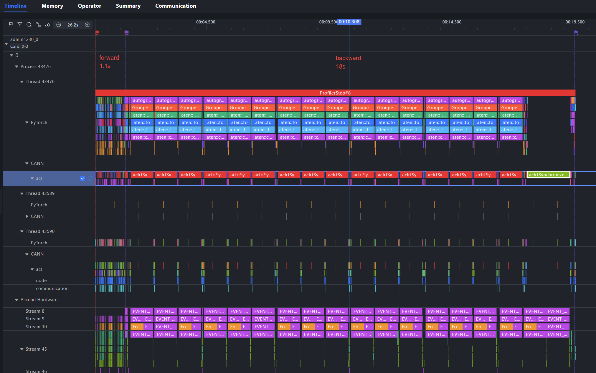
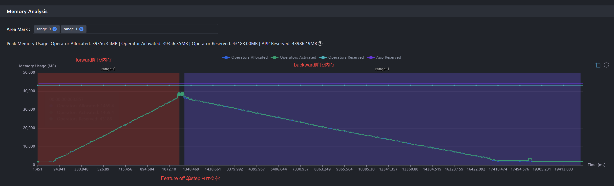
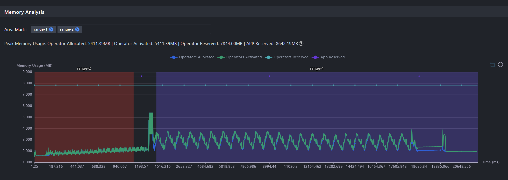
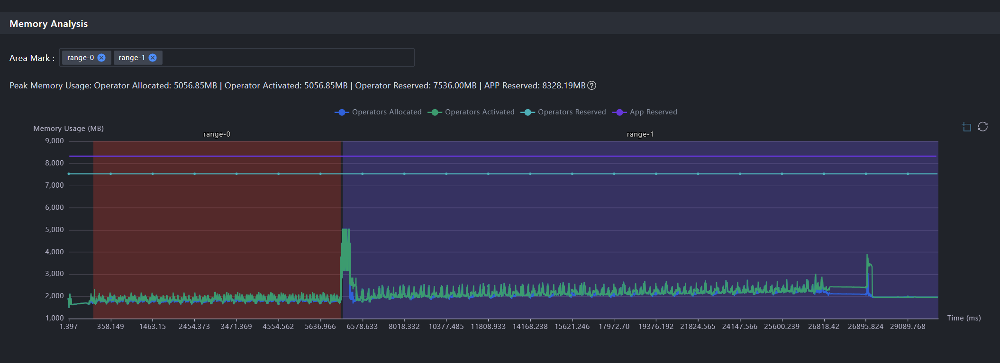
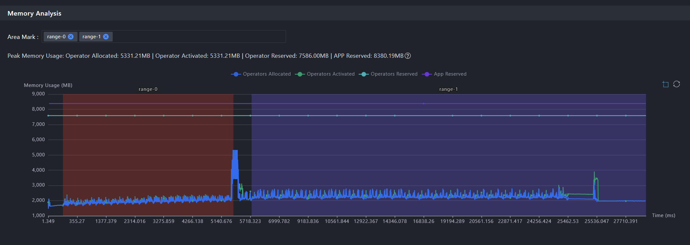
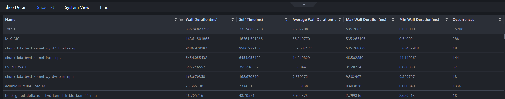

# Kimi K3 实验进度记录（08.20-08.28）

> 上期（08.06-08.19）见 [Kimi-K3实验进度记录（08.06-08.19）](Kimi-K3实验进度记录（08.06-08.19）.md)。本期完成基线演进（E1 → E2）与 E2 上的单变量特性矩阵（FLA / 重计算 / swap activation），仅记录关键结论。

**代码线说明**（本期涉及）：

- **E2**：PR #4025 主线2026/08/24合入版 `pytorch/torchtitan@5fecad92`，**debugmodel 放大至 1.02B 参数**（32 专家 latent MoE + 6 层 MLA， E0 的 10.2 倍），是本期的主实验对象。
- **E1**： E2 的一个历史中间 commit ，分为E1-1da `1da44c16`版本（未叠加FLA融合算子特性）和叠加版本E1-af9 `af9dc456`（叠加FLA融合算子特性）
	- E1-1da `1da44c16`版本： E2 合入前，与E0相同体量， ~1 亿参数，使用默认SDPA `ScaledDotProductAttention`，该路径避免了 E0 手写 MLA 中显式保留的 `scores -> softmax -> matmul` 中间量，因此**在内存占用和单step时延上，相比E0有大幅优化**
	- E1-af9 `af9dc456`版本：在 E1-1da的基础上叠加 FLA 融合算子特性形成的演进线（`the-fall-moon/torchtitan@9c296f44`，fla-eager 分支），在其之上接入了 KDA 三算子（短卷积/门控 RMSNorm/attention residual）的 FLA 融合实现。
- **E0**：PR #4025 早期完整 head `pytorch/torchtitan@9f60a3d6`（上期 08.06-08.19 冻结的主实验基线），~1 亿参数、13 层 debugmodel（与 E1-1da 同体量），MLA attention 为手写 eager 路径（显式保留 `scores -> softmax -> matmul` 中间量），是本期三线对比的演进起点。

环境不变：CANN 9.1.0 正式版、PyTorch 2.12 + torch_npu 2.12、四卡 FSDP2 纯数据并行、910B3。


## 一、E0/E1/E2 三线对比
详细实验过程记录可见《E1-fla-eager内存压力与性能基线实验报告-20260825》（内部文档）

### 1.1 E0 vs E1-1da（SDPA） vs  E1-af9（FLA融合算子）

| 指标                             |         E0 `9f60a3d` |    E1-1da `1da44c16` | E1-af9 `af9dc456`（FLA融合算子） | 解读                                            |
| ------------------------------ | -------------------: | -------------------: | -------------------------: | --------------------------------------------- |
| 平均 step time                   |        `4253.401 ms` |        `4005.090 ms` |              `4832.350 ms` | E0 到 1da 约快 `5.84%`；af9 抵消该收益并比 E0 慢 `13.61%` |
| 名义 padded 全局吞吐                 | `15407.907 tokens/s` | `16363.179 tokens/s` |       `13561.931 tokens/s` | E0 到 1da 约提升 `6.20%`；af9 比 E0 低 `11.98%`      |
| after-forward max active       |       `20258.80 MiB` |        `7806.41 MiB` |              `6006.47 MiB` | E0 到 1da 已下降约 `61.47%`；af9 再下降 `23.06%`       |
| after-backward max peak active |       `25009.06 MiB` |       `12558.64 MiB` |             `10757.10 MiB` | E0 到 1da 已下降约 `49.78%`；af9 再下降 `14.35%`       |

“E1 显存大幅下降”的主要部分发生在 **E0 到 1da 的早期演进**，而不是 af9（FLA融合算子）单提交。
1da 使用默认 `ScaledDotProductAttention`（SDPA），该路径避免了 E0 手写 MLA 中显式保留的 `scores -> softmax -> matmul` 中间量；**从理论上分析，这是E1-1da在内存占用和单step时延上，相比E0有大幅优化的主要原因**。这与 E0 到 1da 的 large activation 降幅方向一致，但E0 到 E1-1da 的区间还包含多个改动，当前没有算子级 memory trace，不能将全部数值严格归因给 SDPA 一个因素。

FLA融合算子应用在 E1-1da `1da44c16` 版本模型上，未见明显性能收益。其节省约 `1.8 GiB` forward active 和 backward peak active，但名义吞吐下降约 `17.12%`，**以较高的性能代价换取了较少的内存收益**。

### 1.2 E2从主线的FlexAttention回退为SDPA
- **FlexAttention 路径不可用**：E2 上游默认的 FlexAttention（文本+视觉）在当前 NPU 编译链（Triton-Ascend 3.2.0 / Inductor）上被阻断（`DeferredLine` / `NoTritonConfigsError`）。基线因此采用 SDPA 回退路径：文本 causal SDPA、视觉 non-causal SDPA + 精确 block-diagonal mask，另有 FSDP 尾部 unit 兼容修复（norm/lm_head 分片独立，复用 E0/E1 已验证方案）。
- 相关代码：[Coco970963014/torchtitan at kimi-k3-npu-compat-sdpa-fsdp](https://github.com/Coco970963014/torchtitan/tree/kimi-k3-npu-compat-sdpa-fsdp)（commit `709088ed`）。

涉及变更如下：（11 个生产/测试文件，+242/-24）

| 文件                                                      | 改动                                                                        | 目的                                                          |
| ------------------------------------------------------- | ------------------------------------------------------------------------- | ----------------------------------------------------------- |
| `models/common/attention.py`                            | `ScaledDotProductAttention` 支持 packed `[T,N,H]` 布局与异构 head 维（Q/K=96、V=64） | NPU 无 Flex 编译链，文本 attention 退 SDPA                          |
| `models/common/decoder.py`                              | attention backend 分发调整，SDPA 路径返回 `None` mask                              | 接 SDPA                                                      |
| `models/common/vision_encoder.py`                       | 新增 `VisionScaledDotProductAttention` + block-diagonal mask 生成             | 视觉 attention 退 SDPA                                         |
| `models/kimi_k2_7/vision_encoder.py`                    | 按 backend 选择 Flex `BlockMask` 或 dense SDPA mask                           | 同上（K3 视觉塔复用 k2_7 代码）                                        |
| `models/kimi_k3/config_registry.py`                     | 新增实验配置 `kimi_k3_debugmodel_npu_compat`                                    | 一键切 NPU 兼容路径，不动默认配置                                         |
| `models/kimi_k3/parallelize.py` + `distributed/fsdp.py` | `separate_norm_and_lm_head=True`（自 E1 `9c296f44` 移植）                      | 修 ChunkedLossWrapper 跨 forward/backward 边界的 FSDP storage 错误 |
| 4 个 `tests/unit_tests/` 文件                              | packed SDPA/视觉 SDPA/K3 配置/FSDP 分离的单测                                      | 回归保护                                                        |

### 1.3 E2 workload确认
#### E2与E1同级workload导致OOM
E2 首次尝试 E1 同级 workload（16384 tokens/rank）在第一个 forward 即 OOM，四 rank 全部一致：

| 证据       | 值                                                                                |
| -------- | -------------------------------------------------------------------------------- |
| 失败点      | step 1 forward，MoE `_situ_glu` 尝试追加 `98 MiB` 失败                                  |
| 已分配      | `58.26-58.38 GiB`（四 rank）                                                        |
| reserved | `59.88-59.90 GiB`，卡容量 `60.96 GiB`                                                |
| Run      | `e2_b3_compat_memory_tokens16384_ctx8192_4step_20260825_01`（`train_exit=1`，日志保留） |
OOM 原因：activation 体量近似正比于参数量 x token 数。E1 在 16384 tokens/rank 的 after-forward active 为 `6006.47 MiB`（100.03M 参数）；E2 参数 `10.20x`、token 减半后 forward active 已达 `36175.01 MiB`，外推回 16384 tokens 即约 `58-60+ GiB`，超过可用容量。

E1 的 `local_batch_size=2, seq_len=8192` 由 MMDataLoader bin-pack 为每 rank 16384 稠密 token；E2 新数据管线为 token 预算打包，`tokens=8192/rank` 是可比的每 rank token 预算，数据集同为 `cc12m-test`（相同 patch/图像参数）。 E2 无法在 16384 tokens/rank 下运行，因此 E2 workload 确定为 E1 的一半。

### 1.4 E0 vs E1-1da vs  E2（SDPA路径）

三线模型规模不同（E0/E1 debugmodel 约 100M，E2 为 1.02B），下列数字是**跨线工程趋势对照，不是严格 A/B变量实验**；吞吐按名义 token 归一，内存列原值、不做单变量归因。

| 指标                         |                E0 `9f60a3d` | E1-1da `1da44c16` |     E2 `5fecad92` |        E2 相对 E1-1da |
| -------------------------- | --------------------------: | ----------------: | ----------------: | ------------------: |
| 模型参数                       |                     ~`100M` |     `100,032,452` |   `1,020,653,472` |            `10.20x` |
| tokens/rank/step           |                     `16384` |           `16384` | `8192`（16384 OOM） |              `0.5x` |
| 名义 global tokens/step      |                     `65536` |           `65536` |           `32768` |              `0.5x` |
| 平均 step time               |               `4253.401 ms` |     `4005.090 ms` |    `18603.257 ms` |                   — |
| 名义全局吞吐                     |             `15407.907 t/s` |   `16363.179 t/s` |    `1761.412 t/s` | `-89.2%`（`9.29x` 慢） |
| 每 global token 耗时          |                  `64.90 us` |        `61.12 us` |       `567.72 us` |             `9.29x` |
| CV                         |                    `0.984%` |          `0.789%` |          `0.226%` |                  更稳 |
| after-forward max active   |              `20258.80 MiB` |     `7806.41 MiB` |    `36175.01 MiB` |             `4.63x` |
| after-backward peak active |              `25009.06 MiB` |    `12558.64 MiB` |    `39356.35 MiB` |             `3.13x` |
| after-optimizer max active |                 约 `194 MiB` |      `193.96 MiB` |     `1965.33 MiB` |            `10.13x` |
| peak reserved              | `27972.00 MiB`（chunks=8 口径） |    `14620.00 MiB` |    `43210.00 MiB` |             `2.96x` |

#### E1-1da vs  E2 差异分析

1. **模型规模是第一变量。** E2 每 token 耗时是 E1-1da 的 `9.29x`，而参数量是 `10.20x`；按"参数量 x token"归一，E2 优于线性劣化约 `10%`（10.20/9.29 ≈ 1.10）。方向合理：E2 的 dim（1024 vs 256）与 head 数（16 vs 4）更大，单算子 shape 更大、固定开销摊薄，设备利用率更高。E0->E1-1da 约 `+6.2%` 的实现级吞吐差在 E2 的规模效应下不可直接外推。
2. **activation 体量决定容量上限。** E2 以一半的 token 预算消耗 E1-1da `4.63x` 的 forward active（`36175.01` vs `7806.41 MiB`），与参数-token 乘积预期 `5.10x` 同量级且略低——两条线的 attention 均已是 SDPA 路径，activation 体量基本按"参数 x token"线性放大。结构差异逐项拆解见《E2对比E1的结构差异解读-20260825》（内部文档）。这直接把 E1 的 workload 挡在门外：16384 tokens/rank 需要约 `58+ GiB`，超过 `60.96 GiB` 容量。
3. **optimizer state 恒定按参数等比。** E2/E1-1da = `10.13x`，参数比 `10.20x`；两条线一致证明 optimizer state 不是内存优化对象。
4. **稳定性更好。** CV `0.226%` 优于 E1-1da `0.789%` 与 E0 `0.984%`；单步耗时更长使固定抖动被摊薄。
5. **HBM 与 allocator 差距同向。** 物理 HBM 峰值 `47.4 GiB` vs allocator reserved `43.2 GiB`（差约 `4.2 GiB`），与 E1（batch=4 60-step 基线 workload）的 `27.8 vs 24.3 GiB`（差约 `3.5 GiB`）同方向同量级，属 torch_npu 运行时固定开销。

## 二、E2 重计算+FLA融合算子 单变量实验

统一测试口径：四卡、8192 tokens/rank、无 profiler、与上节E2基线比较。

| 特性                            |    step 时长 | forward active | 结论                                    |
| ----------------------------- | ---------: | -------------: | ------------------------------------- |
| FLA 三算子（conv/norm/attnres 融合） | **+23.8%** |     **-24.1%** | 内存换时延，不在 Pareto 前沿                    |
| SelectiveAC（当前titan主线默认）      |      +7.7% |         -91.4% | NPU 上非最优                              |
| FullAC                        |  **+5.2%** |     **-93.8%** | **双维度最优**                             |
| MemoryBudgetAC                |        不可测 |              — | 上游 K3 拒绝 compile（NotImplementedError） |

**核心结论**：

1. **FullAC（全量重计算）是当前 NPU 上的最优激活内存方案**：+5.2% 时延换 -93.8% 激活，且同时优于当前titan主线默认的 SelectiveAC（后者 save-op 集合按 CUDA 算子族 curate，NPU 分发下大量算子不命中、退化为"近似全重算 + 逐算子策略开销"）。**建议在 NPU 上直接用 FullAC 替代上游默认**。
2. **FLA 融合算子在两个规模上复确认为"内存换时延"**：E1（1 亿）与 E2（10.2 亿）均测得 +21~24% 时延换 15~24% 内存下降，当前 Triton-Ascend 栈上不建议启用。
3. **当前暂无必要进行`MemoryBudgetAC`尝试**，因为MemoryBudgetAC属于在SelectiveAC与FullAC之间精细化寻优，目前NPU 上FullAC双维度最优，无需再尝试MemoryBudgetAC寻优。


## 三、E2 swap activation 实验

在 E2 上完成了两版 swap activation（激活临时搬运到 host 内存）的正确性验证与收益评估：

- **P0（全量搬运）**：调用 PyTorch 公开的 `torch.autograd.graph.save_on_cpu`，将 backward 所需的全部 saved activation 无差别搬运到 host——用于回答"能否安全搬运 + 内存收益上限"。
- **P1（选择性搬运）**：参考FSDPTurbo方案，自实现 `saved_tensors_hooks`，仅搬运 ≥1 MiB 且不与块输入共享 storage 的张量，并显式使用 pinned host buffer——用于修正 P0 无法控制的拷贝路径与安全边界。

| 指标             |      无特性 | P0（公开 save_on_cpu 全量搬运） | P1（选择性 + pinned 搬运） |          FullAC |
| -------------- | -------: | ----------------------: | ------------------: | --------------: |
| step 时长        |   18.9 s |          24.1 s（+27.6%） |      24.1 s（+27.6%） |   19.8 s（+4.8%） |
| forward active | 36.1 GiB |         1.9 GiB（-94.8%） |     2.1 GiB（-94.0%） | 2.2 GiB（-93.8%） |

- 相关代码：
  - P0：[experiment/e2-p0-swap-activation-20260826](https://github.com/Coco970963014/torchtitan/tree/experiment/e2-p0-swap-activation-20260826)（特性 commit `cbbb280a` + 修复 commit `7eb3e79d`）
  - P1：[experiment/e2-p1-selective-20260826](https://github.com/Coco970963014/torchtitan/tree/experiment/e2-p1-selective-20260826)（特性 commit `6f9af937`，HEAD `f7efdf55`）


<p align="center">E2 四臂 step 耗时构成</p>


<p align="center">Feature Off 单Step内存变化</p>


<p align="center">Full AC ON 单Step内存变化</p>


<p align="center">P0 ON 单Step内存变化</p>


<p align="center">P1 ON 单Step内存变化</p>

内存工具使用：
Timeline旗帜标记，框选范围，再Memory中联动呈现，用于分析不同阶段内存变化，这个功能很好用，点赞推广下

Memory，考虑添加，根据内存曲线跳转至Timeline界面功能（当前因时间戳偏移量无法对齐，暂未实现，可考虑根据选中点距离最近的分配/释放算子作为跳转对齐依据）

Memory，恢复“回退至最后一次缩放区域”功能，应该是历史功能，被误删了

## 四、swap activation 理论上限分析

### H2D与D2H 搬运带宽实测
实测数据（卡 4，1 GiB bf16）：

| 路径 | 带宽 | 谁在搬 |
|---|---:|---|
| pageable D2H | **3.0 GB/s** | CPU 搬（驱动中转） |
| pageable H2D | 17.9 GB/s | DMA 搬（驱动中转） |
| pinned D2H | 20.8 GB/s | DMA 直取 |
| pinned H2D | 22.9 GB/s | DMA 直放 |

**H2D 两个都快的原因：** 设备写入内存时，驱动可以走一个统一路径——它先把目标 pageable 地址通过 `get_user_pages` 锁页 + 建立临时 DMA 映射，DMA 引擎直接写进用户内存。写方向不需要设备读取用户内存内容的中间副本，锁页开销是一次性的、可摊薄到整次传输。所以 pageable H2D（17.9）离 pinned H2D（22.9）只差约 22%——差值主要是每次调用建立/拆除映射的固定成本。

**D2H 慢的原因是结构性的：** 设备 DMA 引擎**不能信任一块随时可能被换走的 pageable 内存作为源**——如果 DMA 读到一半 OS 把那一页换出了，数据就坏了。所以驱动的做法是：

```text
pinned D2H（理想路径）：
  DMA 引擎 ──直接读──> pinned buffer           一步，20.8 GB/s

pageable D2H（实际路径）：
  ① 驱动分配一块内部 staging pinned buffer
  ② DMA 引擎把数据 ──> staging buffer          （20 GB/s 级）
  ③ CPU 执行 memcpy：staging ──> 用户的 pageable 内存
     （这是纯 CPU 内存拷贝，走内存控制器，实测就 ~3 GB/s 这个量级）
  ④ 释放 staging
```

第 3 步的 CPU memcpy 是瓶颈：它不占用 DMA 引擎，占用的是 CPU 内存总线，而且 pageable 目标页可能触发缺页中断、写时复制等内核路径。**所以 pageable D2H 的 3 GB/s 不是 PCIe 慢，而是"DMA 高速段之后接了一段 CPU 低速段"，整条链被 CPU 段锁死。**

### swap activation 理论上限难以超过FullAC

swap 与 FullAC 消除的是同一批激活，但**边际代价由不同变量决定**：

```text
FullAC 代价 ≈ T_forward        （backward 时重算一次前向；实测 +0.91s ≈ 理论 0.95s）
swap 代价   ≈ 2 × V / B        （33.4 GiB 激活往返搬运；实测 +5.2s 完全吻合）
```

其中`T_forward`为一次前向传播耗时，重计算可近似于认为，在backward 时重算一次前向；**实测 +0.91s，仅占 step 的 5%**（0.95s / 18.9s，backward 占 94%）。


<p align="center">E2 四臂 step 耗时构成</p>

计算swap 代价，相当于将 33.4 GiB 激活 往返搬运2次，B为搬运带宽，实测约20GB/s。

即使将搬运时间做完美异步掩盖，也会有约`1s`的首段Backward无法掩盖，加上H2D与D2H引擎启动代价，**在当前场景下，swap activation最多追平FullAC，无法超过**。可保留为条件性候选（forward 占比 >30% 的 workload、或主机互连升级时再评估）。

相关profiler实测数据已留存（`D:\003Data\08月-Kimi-K3模型适配\FullACandSwapActivation\`）。


PS：Backward时间极长主要原因是chunk_kda_bwd_kernel_wy_dA_finalize_npu、chunk_kda_bwd_kernel_intra_npu算子执行耗时长，是否有优化空间？
python侧由ChunkKDAFunctionBackward下发（chunk_kda_bwd_kernel_wy_dA_finalize_npu、chunk_kda_bwd_kernel_intra_npu）


<p align="center">KDA backward 内核热点</p>


## 五、下一步计划
1. Triton-Ascend 升级与 FlexAttention 解锁：将 Triton-Ascend 升级到最新正式版（当前为 v3.2.2，官方 Q3 计划升级到 Triton 3.5/3.6，具体版本以实际发布为准），升级前先核对该版本与 CANN 9.1.0 / torch_npu 2.12.0 的版本配套关系；升级后优先重试 E2 上游默认的 **FlexAttention 路径**——它被当前 Triton-Ascend 3.2.0 编译链（Inductor `DeferredLine` / `NoTritonConfigsError`）阻断。
2. 并行扩展：参考社区 RFC #3029 的实现，在 NPU 上自行逐步复现。社区贡献者（QIU023）已在个人 fork 完成 K3 全量 5D 并行（58 组合验证），以 ~2.8 万行预览 PR #4281（DO NOT MERGE）备案，并按维护者要求拆为三个正式 PR 逐个评审：PP [#4312](https://github.com/pytorch/torchtitan/pull/4312)（AttnRes 跨 stage 缓存适配器）、CP [#4313](https://github.com/pytorch/torchtitan/pull/4313)（MLA Ulysses + KDA KCP）、EP [#4314](https://github.com/pytorch/torchtitan/pull/4314)（per-expert ↔ grouped-GEMM 转换）。维护者明确官方 K3 训练未使用 TP，优先 DP/EP/PP/CP。这些实现均为 CUDA 环境验证且尚未合入主线，**不等待上游，以之为设计参考在 NPU 上按「HSDP → EP → PP/CP」顺序自行实现**：
	- **HSDP（先做）**：上游已解禁（`dp_replicate` 移出 K3 不支持列表），主要工作是 dataloader 分片与 vision encoder FSDP mesh 兼容，风险最低；
	- **EP（其次，项目既定方向）**：E2 的 32 个专家当前被 FSDP2 当普通参数切分（`ep_degree=1` 硬编码）；grouped GEMM 已在 NPU 训练中验证可用，参考 #4314 的转换接口设计，需关注 `torch._grouped_mm` 空专家组限制在 torch_npu 上的表现；
	- **PP/CP（最后）**：Block AttnRes 需跨 stage 传输 residual（#4312 双梯度通道设计为主要参考），CP 涉及 KDA 内核改造（KCP），复杂度最高。